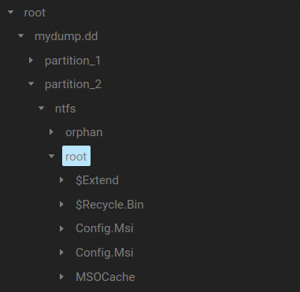
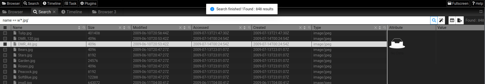

# About 

**TAPIR** (Trustable Artifacts Parser for Incident Response) is a multi-user, client/server, incident response framework based on the [TAP](https://github.com/tap-ir/) project. 

- It take as input  **file** (can be a disk dump or any kind of file), a **directory** containing different files (from a triage tool), a **disk dump**, or a disk **device**. Use different plugins to virtually extract data and metadata from those files, let you access them in an homogenous way via a REST API, and integrate a search engine [TAP-QUERY](https://github.com/tap-ir/tap-query) that let you create complex query to filter that data and metadata. 

- Server can be accessed remotely or locally via it's REST API, or via :

  - [TAPyR](https://github.com/tap-ir/tapyr) a python binding that can be used to create script to automate your investigation, 
  - [TAPyR-cmd](https://github.com/tap-ir/tapyr-cmd) unix like shell command.
  - [TAPIR-Frontend](https://github.com/tap-ir/tapir-frontend) a web UI.


- It's multiplateform and run on Linux, Mac OS X, and Windows.

This documentation is a user guide that will help you use and perform incident response with TAPIR. 

?> You might also be interested in [bin2json](https://github.com/tap-ir/bin2json) a simpler tool based also based on the [TAP](https://github.com/tap-ir/tap) library. **bin2json** can automatically and recursively extract metadata from files or devices to a JSON file that can be sent to a **siem** or analyzed with tool like [JQ](https://github.com/stedolan/jq).

## Download

Release binary are available [here](https://github.com/tap-ir/tapir/releases)

## Building

For building instruction follow this [link](https://github.com/tap-ir/tapir#building).

## Running 

For instruction to launch the TAPIR server follow this [link](https://github.com/tap-ir/tapir#running).

# Concept

To understand how **TAPIR** work it's good to understand some of the concept and terms related to this project.

## Tree and nodes

**TAPIR** is used to ingest some data comming from a disk dump, triage files, device, ... and virtually extract data and metadata from those files. Those data are internally represented by a tree. Each node of the tree could represent either a file or a directory. Even if a node is a file it can have children that represent sub files contained in the parent file. This can be used to represent a file system (eg. after parsing an NTFS disk dump or an MFT), but also for exemple a registry hive, or any other kind of data. 

The node can be accessed on the tree by using a path like in tradional file system. 

## Attributes

Each node of the tree have [Attributes](https://tap-ir.github.io/docs/dev/rustdoc/tap/attribute/struct.Attributes.html), those attributes can represent metadata, structure, or any kind of information related to a node.  

[Attributes](https://tap-ir.github.io/docs/dev/rustdoc/tap/attribute/struct.Attributes.html) are a list of [attribute](https://tap-ir.github.io/docs/dev/rustdoc/tap/attribute/struct.Attributes.html) which are composed of a name and a [value](https://tap-ir.github.io/docs/dev/rustdoc/tap/value/enum.Value.html) of different type. 
An [attribute](https://tap-ir.github.io/docs/dev/rustdoc/tap/attribute/struct.Attributes.html) can point to an other attribute as a pointer can point to an other structure in the "C" language.

To represent an attributes path as a string the hierarchy of attribute is joined by '.'.  For exampe, an ntfs file,  will contain a standard\_information attribute that himself will contain an accessed_time attribute with value of type time. The path representing this attribute will be 'ntfs.standard_information.access_time' 

## Plugins

Nodes and attributes are added in the tree by parser plugins. Some plugin like the **exif** plugin will only add information to existing node. For example the **exif** plugin will parse the content of an image containing exif information and will add some attribute to that file node like 'exif.primary.model'. In the same way the **plugin** will add the calculated hash of a file to it's attribute.

Other plugins like the NTFS plugins will create node with specific attribute. The **NTFS** plugin will read data coming from an other file and will create new node representing the content of that file system, each node will also have atrtibute corresponding to their ntfs metadata. 

A last time of plugin exist, the "input" plugin those plugin, is used to access data that are external to the **TAPIR** tree and load them in the tree to be able to be parsed by other plugins. For example the **local** plugin let you access the file present in the **TAPIR** server filesystem, the **DEVICE** plugin can be used to read a raw device, or the **S3** plugin can be used to read file from an **S3** server.

Each plugin take specific argument as input, but generally the plugin take a path to the node in the tree that it will parse and extract data from.
 
**TAPIR** is part of the [TAP](https://github.com/tap-ir/) project and the file type it support is the same as the tap project. (When new parser plugin is added to [TAP](https://github.com/tap-ir/) **TAPIR** is updated to include the new plugins).

At time of writting this documentation this is the plugin included in **TAPIR** : 

| Name | Category | Description |
| ---- | -------- | ----------- |
| local |Input | Load files or directory from the filesystem |
| exif | Metadata | Extract EXIF info from file |
| hash | Metadata | Hash file attribute |
| s3 | Input | Load files from a s3 server |
| merge | Util | Merge files into one file |
| ntfs | File system | Read and parse NTFS filesystem |
| mft | File system	| Read and parse MFT file |
| magic | Metadata | Detect magic and file data compatible with plugins |
| prefetch | Windows | Parse prefetch file |
| partition | Volume | Parse MBR & GPT partition |
| lnk | Windows	| Parse lnk file |
| evtx | Windows | Parse evtx file |
| registry | Windows | Parse registry file |
| clamav | Malware | Scan file content with ClamAV | 
| device | Input | Mount a device |
| yara | Malware | Scan file content with Yara |


# Command line

To use TAPIR via command line remotely or localy, you have to install [TAPyR-cmd](https://github.com/tap-ir/tapyr-cmd).
TAPyR-cmd is a bunch of python script that are used like Unix commands. Some command output result are text or binary that can be piped to Unix command, and some other command output is in JSON format, so it can be piped to tool like [JQ](https://github.com/stedolan/jq) to filter data.

## API key and remote access

If you changed the default **API KEY** of your **TAPIR** server (that's recommend), you should set the key as an environment variable, so the command line tool can use it. 


On Linux or MacOS X :

```bash
export TAPIR_APIKEY=newkey
```

If you're connecting to a remote **TAPIR** server or if you change the default port (3583) of the server you also need to set the address of the server as an environment variable. 

```bash
export TAPIR_ADDRESS=127.0.0.1:3583
```


## Bash completion

When installing [TAPyR-cmd](https://github.com/tap-ir/tapyr-cmd) you can activate bash completion by copying the file `tapyr-cmd-completion.bash` to your `/etc/bash_completion.d/` directory or by executing the command  `source tapyr_completion.bash`
 
## Loading data

The first thing to do after the server is running is to load some data, that need to be analyzed, on the server.
TAPIR come with differents plugins, some of those plugins of type **input** have for goal to load data on the server.
At the moment three plugins exist : 
  - Local who load files (can be a full disk dump, or any kind of files)  and directory recursively (can be a directory containing triage files)
  - Device who let you read the content of a block device directly (a harddisk, or nvme disk)
  - S3 that can be used to read a file from an S3 server

A specific called `scan` can be used to load data via the `local` plugin and parse those data automatically.

### Local

To load a unique file via local just run : 

```bash
xlocal file_name
```

To load all files recursively from a directory (eg. loading triage output) : 

```bash
xlocal directory_name
```

## Running plugins

### Scan

**Scan** is a powerfull script, by using it you can avoid to manually launch any of the **TAPIR** plugins. **Scan** will load a dump, or a directory, and once the data are loaded it will automatically run other plugins to extract metadata from that files. To do that scan will run **TAPIR** **magic** plugin on each file, this plugin will detect the type of the file and add that information as an attribute inside **TAPIR** tree, then the scan script will check if any of the **TAPIR** plugins is compatible with that file type. If that's the case, it will then run that plugins. This will be done recursively, and can generate lot of data, that can take a huge amount of RAM, but you will ensure to have access as most as metadata and data that you can. 

For example if you run scan on a disk dump, it will automatically load the file, run the partition plugins, to virtually extract partition from the disk, run the **ntfs** plugins if the disk is formated in **ntfs**, and run plugins for each other file compatible with **TAPIR** plugins, like **evtx** or **registry**, if the dump contain thousand of registry file in any directory for each of them a plugins will be launch. (See [listing tasks](https://tap-ir.github.io/#/?id=listing-tasks) to know how to see which plugins was launched).

To run the scan just do :

```bash
xscan path_to_file_or_directory
```

If you already loaded some files just run :

```bash
xscan
````

### Running plugin manually 

To run a plugin just execute the script corresponding to the name of the plugin, parser plugin generally take as first argument the path to the file you want extract. 

Example to extract the content of an **MFT** file loaded into **TAPIR**

```bash
xmft /root/MFT
```

## Tasks

When a plugin is executed it's added to **TAPIR** scheduler that will execute it as soon as it can. By running a script like **scan** for example many tasks can added to the queue at the same time. A task is composed of a plugin name and some arguments passed to this plugins. Each task can have 3 states :  **waiting**, **running** or **finished**, depending if they are waiting to be executed, they are currently being executed and if execution is finished. When a task is in the finished state, the result of the execution of the task is associated to it. The result of the task can be an error (could came from wrong argument provided to the plugin, parsing errors, ...) or some result specific to the plugin. 

### Listing tasks

To list all task with their argument just run the `ps` command

### Tasks summary

To display a summary of the number of task executed by plugin type use the `psstat` command : 

## Browsing 

Once your data are [loaded](https://tap-ir.github.io/#/?id=loading-data) and [parsed](running-plugins) by some plugins,
you will want to browse the **TAPIR** tree made of nodes (files and directories) and attributes (metadata and data).

### Listing files

To list file you can use the `ls`, always prepend **/root/** before the name of the loaded files. 

```bash
xls /root/cfreds_2015.dd/partition_2/ntfs/root/Windows/System32
```

?> The `ls` command and some other can use [bash completion](https://tap-ir.github.io/#/?id=bash-completion) (either localily or remotely) that make it a lot more convenient to use.

### Listing attributes

To list file attribute you can use `attr` command like the `ls` command by providing the path of any nodes in the tree.
It will output attributes information on the JSON format. To parse that information we recommand to use tool like [JQ](https://github.com/stedolan/jq)

To display the [attributes](https://tap-ir.github.io/#/?id=attributes) of the $MFT in raw JSON format

```bash
xattr "/root/mydump.dd/partition_2/ntfs/root/\$MFT"
``` 

To display all [attributes](https://tap-ir.github.io/#/?id=attributes) of the $MFT via `JQ` 

```bash
xattr "/root/mydump.dd/partition_2/ntfs/root/\$MFT" | jq
```

To display the size of the $MFT 

```bash
./xattr "/root/cfreds_2015.dd/partition_2/ntfs/root/\$MFT" | jq .attributes.data.size
```

To display the access time contained in the standard information structure extracted by the **NTFS** or **MFT** plugins :

```bash
./xattr "/root/cfreds_2015.dd/partition_2/ntfs/root/\$MFT" | jq .attributes.ntfs.standard_information.accessed_time
````

!> We need to add **quote**  when there is space in the path of the file and **backslash** for special character like **$** to avoid them being interpreted by the shell

### Adding attribute

You can also add attributes to notes it can be used to share something you observed with other analysts. 
To do that use the `xattr` command followed by the attribute name, the attribute value, and the pass of the node 

```bash
xattr tag malware /root/dump.dd/partition_2/ntfs/root/12345.exe
```

### Displaying file content

To display the content of a file on the console you can use the command `xcat`.

```bash
xcat /root/dump.dd/partition_2/ntfs/root/Users/desktop.ini
````

You can also pipe the content of file to an other command for example to display the content of the file as hexadecimal.

```bash
xcat /root/cfreds_2015.dd/partition_2/ntfs/root/pagefile.sys | xxd | less
```

### Downloading files

To download the content of the file you can simply use the download command 

```bash
xdownload /root/cfreds_2015.dd/partition_2/ntfs/root/Windows/System32/config/SYSTEM
````

<!-- ### Uploading files-->

<!--To upload file to the -->


## Query & timeline

**TAPIR** integrate the [tap-query](https://github.com/tap-ir/tap-query) library to let create powerfull query to search precise stuff in all the data and metadata extracted by the plugins.You can search for some attribute name, value or search inside data (content of file). **TAPIR** also let you create timeline that integrate timestamp generated by the different parser plugins (ntfs, registry, event logs, exif, ...), each new plugin integrated into **TAPIR** will automatically have it's timestamp attribute integrated into the timeline. 

Search and timeline are multithreaded and generally very fast to generate (few seconds) even if millions of attributes is present in the **TAPIR** tree. Searching is generally IO bound and will depend of the speed of your disk, however we stronly recommend to use **TAPIR** with data stored on NVME disk. 

### Query syntax 

Each query is made of one expression (of a specified type) or multiple expression separated by an operator. The constructed query can be passed to the `find` command that will return 

|Expression     | value matched |
|---------------|---------------|
|name           | file name     |
|attribute.name | attribute name|
|attribute:'attribute\_name'|attribute name and attribute value|
|data           | file content  |

 
Type to specify for name and attribute : 

| Type | value matched                               |
-------|---------------------------------------------|
|(u)   | default, type to match string               |
|r     | regular expression                          |
|w     | wildcard (use ? and * to replace character) |
|f     | fuzzy matching                              |

Type to specify for 'data' :

| Data type | value matched                                                   |
|-----------|-----------------------------------------------------------------|
| (r)       | default, search via regular expression on binary and UTF-8 text |
| t         |  search string inside UTF-8 or UTF-16 text                      |

Operator that can be used between expression :

   - and
   - and not
   - or

### Examples 

#### Finding files

Using the **name** expression, you can match on file name.

* Seach all file named **image1.jpg**

```bash
xfind  "name == 'image1.jpg'"
```

* Search all file with an extension of type .jpg (lower case) using wildcard : 

```bash
xfind "name == w'*.jpg'"
````

* Search for file with a bame starting by image and with an underscore using wildcard : 

```bash
xfind "w'image?_*.jpg'
```

* Search file name containing an extension .jpg or .tiff using regexp : 

```bash
xfind "name == r'([^\s]+(\.(?i)(jpg|tiff))$)'"
```

* Search for a file named image1.jpg or starting by image 2 : 

```bash
xfind "name == 'image1.jpg' or name == w'image2*'"
```

#### Searching for data

Using the **data** expression, you can match content of files.

* Search binary or text file containing ascii character 'hello' :

```bash
xfind "data == 'hello'"
```

* Search file having ELF signature 

```bash
xfind  "data == '\x7F\x45\x4C\x46'"
```

* Search UTF-8 or UTF-16 file containing 'икра'  

```bash
xfind  "data == t'икра'"
```

#### Matching attributes

Using the **attribute.name** expression you can search for file having an [attributes](https://tap-ir.github.io/#/?id=attributes) matching a specific name. 

* Search for files with an 'exif' attribute (meaning file was parsed with the **exif** plugin)

```bash
xfind "attribute.name == 'exif'"
```

* Search for files with an 'exif.primary.model'  

```bash
xfind "attribute.name == 'exif.primary.model'"
```

* Search for a files with an attribute named "exif" something then "model", with wildcard 

```bash
xfind "attribute.name == w'exif.*.model'"
```

Using the **attribute:'attribute_name'** expression you can match for a value of a specific attribute.

* Search for files with an attribute named 'evtx.event.eventdata.imagepath' with a value containing the string 'powershell' 

```bash
xfind "attribute:'evtx.event.eventdata.imagepath' == w'*powershell*'"
```

* Search for files with an attribute name starting with evtx.event with value containing 'powershell' : 

```bash
xfind "attribute:w'evtx.event*' == w'*powershell*'"
```


* Search for files for which any of the attributes have a value containing the string 'powershell'

```bash
xfind "attribute:w'*' == w'*powershell*'"
```


#### Creating timeline

To create a timeline you can use the `xtimeline` command just provide the starting date, the end date and the name of file where to output the timeline.


```bash
./timeline 2022-06-17T15:28:45 2022-07-01T15:28:45 mytimeline.csv
```

## Python scripting

For scripting in python you can launch the `xshell` command it will create a **TAPIR** session using the [TAPyR](https://github.com/tap-ir/tapyr) library. Or you can create this session manually, then by you can start scripting by using the different function provide by the API.

### Connecting to the server

To connect manually just launch a python3 shell, import the right library and create a session.
By default it will connect on localhost (127.0.0.1) on port 3583 with the default API key,  you can connect to an other host with specific key by settings the environment [variable](https://tap-ir.github.io/#/?id=api-key-and-remote-access) as we did for the command or by passing the right argument when initializing the Tapirobject.

```python
from tapyr import Tapir

session = Tapir()
```

To connect to the IP 1.2.3.4 on port 1234 with key 'mykey' 

```python
from tapyr import Tapir

session = Tapir(address="1.2.3.4:1234", api_key="mykey")
```

### Using the API 

You can use the the node function to get a node of the tree. 

```python
from tapyr import Tapir

session = Tapir()
windows = session.node("/root/my_dump.dd/partition_2/ntfs/root/Windows")
```

This will return a python object from which you can directly access the node attributes as python instance variable.

!> You can use python3 shell compection to access the attribute by using `tab` 

```python
>>> print(windows.ntfs.is_deleted)
False
>>> print(windows.ntfs.standard_information)
{'accessed_time': '2015-03-25T14:50:50Z', 'altered_time': '2015-03-25T14:50:50Z', 'class_id': 0, 'creation_time': '2009-07-14T03:20:08Z', 'mft_altered_time': '2015-03-25T14:50:50Z', 'version_maximum_number': 0, 'version_number': 0}
>>> print(windows.ntfs.standard_information.accessed_time)
2015-03-25T14:50:50Z
```

For more other API function look at the [TAPyR](https://github.com/tap-ir/tapyr) project.

### Using query 

You can use [query](https://tap-ir.github.io/#/?id=query-syntax) directly from the API to search for specific files.
The query API function take a string with query as first parameter and a second a parameter a string with the path from which the query will be applyied. (By default it will search from the root of the tree).
The query function will not return a list of nodes but a list of node\_id. To get a node from an id you can use the node\_id API function.

* To search for all file with a .exe suffix from the root of the tree and display file name

```python
>>> for node_id in session.query("name == w'*.exe'"):
...   print(session.node_id(node_id).name())
...
```

* Each function called from the session object will create a request to the server, to avoid make a request for each in the loop you can use the 'nodes\_by\_id' function that take a list of nodes\_id and return a list of nodes. 

```python
>>> for node in session.nodes_by_id(session.query("name == w'*.exe'"), name=True):
...    print(node.name())
...
```

### Example : Downloading all files that match a query

This python script take a [query](https://tap-ir.github.io/#/?id=query-syntax) as first argument and download file that match a query to the directory specified as second argument.

```python
#!/usr/bin/python3 
from tapyr import Tapir

session = Tapir()

if len(sys.argv) == 3:
  path = sys.argv[2]
  for node in session.nodes_by_id(session.query(sys.argv[1]), name=True, path=True):
    try:
      b = session.download(node.id, path + "/" + node.name())
    except Exception:
      print("Can't download file : " + node.path)
```

You can save this script in a file name 'extract.py' and for example use it like that download all file with suffix .exe in a directory 'excutable' that you will have created in the same directory than the script.

```bash
./extract.py "name == w'*.exe'" executable/
```

If you previously runned the magic plugin or the scan command on the server, that detect file type. You can use the script to extract all files detected has executable even if the extension is not '.exe' like that : 

```bash
./extract.py "attribute:'datatype' == 'application/x-executable'" executable/
```
 
### Example : Searching powershell script in windows event log

This script use [query](https://tap-ir.github.io/#/?id=query-syntax) to search for powershell script in windows events log and display information about the event and the script itself

```python
session = Tapir()

query = session.query("attribute:'evtx.event.eventdata.imagepath' == w'*powershell*'")
for node_id in query:
  path = session.path(node_id)
  node = session.node_by_id(node_id)
  try:
    print("file :", path)
    print("host :", node.evtx.event.system.computer)
    print("created :", node.evtx.event.system.timecreated)
    print("event id:", node.evtx.event.system.eventid)
    print("account name :",  node.evtx.event.eventdata.accountname)
    print("service name :", node.evtx.event.eventdata.servicename)
    print("sid :", node.evtx.event.system.security)
    print("executed by :", node.evtx.event.system.execution)
    print("data :", node.evtx.event.eventdata.imagepath)
  except Exception as e :
    print(e)

query = session.query("attribute:'evtx.event.eventdata.scriptblocktext' == w'*'")
for node_id in query:
  path = session.path(node_id)
  node = session.node_by_id(node_id)
  try:
    print("file :", path)
    print("host :", node.evtx.event.system.computer)
    print("created :", node.evtx.event.system.timecreated)
    print("event id:", node.evtx.event.system.eventid)
    print("sid :", node.evtx.event.system.security)
    print("executed by :", node.evtx.event.system.execution)
    print("data :", node.evtx.event.eventdata.scriptblocktext)
  except Exception as e:
    print(e)
```

# Web UI 

[TAPIR-Frontend](https://github.com/tap-ir/tapir-frontend) is a full featured web user interface directly integrated into the **TAPIR** binary. The interface let you interact with a distant [TAPIR](https://github.com/tap-ir/tapir) server, browse files, directories, search and filter data, create timeline, visualize data, launch plugins, download files ... and a lot of other cool stuff ! 

## Login 

Just launch a browser and connect via http (or https if set in the **TAPIR** configuration) to the same address and port 
than the one configured on the server. (By default http://127.0.0.1:3583/) 

?> When you run the server, if available, a browser will be automatically launch and connect to the web ui locally

Once connected just enter the API key you set on the server to loggin (default is 'key'). 


## Overview


The main window of the UI is composed of a [toolbar](http://tap-ir.github.io/#/?id=tool-bar), and different tabset and [window](http://tap-ir.github.io/#/?id=window). 

## Tool bar

The toolbar is on the top of main window, it's composed of a serie of buttons.


### Launching new window

By default when you connect to the web ui one of each type of window (browser, search, timeline, tasks, plugins) is already launched.
If you need you can click one of the corresponding toolbar button to create a new window of that type. This is handy to compare some directories, 
or keep the result of a launched search or timeline. When a new window is launched it will be added to the current tab group. 
If needed you can detab and [move](https://tap-ir.github.io/#/?id=moving-window) the window. 

### Fullscreen

The  button will set your browser in fullscreen mode, click again on the button or press `esc` on Firefox to exif fullscreen.

### Help 

The  button open a new windows that bring you to this documentation, if your server have internet access.

## Window

The web interface is composed of different window that let interact with **TAPIR** and visualize data.

### Moving Window

Each window can be moved to an other tabset or can be dettabbed and be placed anywhere on the screen.
To do that left click on the window then at the same time moved the window where you want to place it.

<!-- XXX screenshoot/gif anime -->

### Renaming window

You can rename window by double-clicking on their name, this can be useful to find them more easily.


### Maximizing tabset

You can maximize a specific tabset by clicking on , on the top right corner of the window,
this can be helpful to see more data at once. Click back on the button to restore the tabset.

### Popout the viewer

The [viever](https://tap-ir.github.io/#/?id=viewer) is a specific windows that display file content, there is only one viewer on you can't launch an other one,
as it's content is updated when you click on file on any opened browser. The viewer can be poped out to for example be displayed on a second screen.
To do that click on  on the top right corner of the window. To restore the browser in the main window, just close the poped out window.

## Browser

The browser let you browse and interact with the nodes (files and directory) and their attributes in a tree view, that look like a classical file explorer.


The browser is divide into four part the toolbar on the top, then three panel, the directory tree on the left, the file browser on the center, and the attribute panel in the right.

### Browser toolbar


The toolbar is divised in a range of button and a center editable bar.

- Click  to go back to the parent directory.
- Click  to go back to the root directory.
- Modify  and click enter to go to that directory.
- Click  to edit columns.
- Click  to export row selected in the central panel to json or csv, and download a bunch of selected file in a zip. 

### Directory tree



The directory tree let you expand any nodes that have children by clicking on the , if you click on the name of a directory, the list of it's children will appear on the center panel.

### File browser


The file browser show you a table with the current children nodes (files and directory) of the current path. 
If you click on any node on the table (file or directory), it's attribute will be shown on the right panel, if this node have data (for example, file of file system), their data will be displayed by the file [viewer](https://tap-ir.github.io/#/?id=viewer).

When you double click a directory, it will change the current path to that directory.

#### Column

##### Change order

You can change column by doing drap and drop, just left click on the column name while moving the column.


 
##### Sorting


You can sort the column by clicking on the arrow on the top of the column, click again to sort on the other order, and click a third time to cancel sorting. 

#### Searching


You can search on a column, or sorted column by clicking on the magnyfying glass, typin a text and then clicking search. The text you have search will be highlighted.You can click reset to cancel the search.


You can go further and click filter, to filter on your current search. 

#### Selection 


You can select nodes (files and directories) by clicking on the checkbox on the far left column. Once nodes are selected you can [export](https://tap-ir.github.io/#/?id=export) your data.

##### Export

To export selected data click on  button in the toolbar.


You can choose to export the current selection (nodes with checked boxes) by clicking 'selection' or all nodes in the current view by clicking 'all'.

Then you can choose to export to CSV or JSON format : 


You can specify the filename, and then click 'ok' that file will be automatically downloaded by your browser. When you export to JSON all attributes for the selected nodes will appears on the file, when you export in CSV only the currently selected column will be exported to the file, in the same order of the current view.

?> You can add new column by right clicking on the [attributes tree](https://tap-ir.github.io/#/?id=attributes-tree). 

You can also download all selected file to a zip archive by clicking on 'zip'.


You can choose the name of the archive, and if you want you can cypher the archive by adding a password before clicking the 'ok' button.

#### Menu 

By right clicking on a node you will popup a menu that let you do many things, like downloading file, copy data, run plugins, add attribute ...

##### Open in new browser


The open in new browser button will launch a new browser pointing to the current path.

##### Copy


By clicking the copy button you can copy the current file full path, or the current selected text in the clipboard.

##### Download


By clicking the download button you can download the current file. 

?> There is no file size limit, and you can download a full dump or a partition as the file is streamed.

##### Plugins


The plugin button let you run any of the **TAPIR** plugin. When selecting a plugin in the menu, a pop up window will be shown : 


This window will dynamically created for you, so you can enter any of the plugin argument, the default node on which the plugin will apply will be automatically filled with the currently selected node. 

?> When a plugin is added to the [TAP](https://github.com/tap-ir/tap) library and [TAPIR](https://github.com/tap-ir/tapir) it will be automatically added to this menu without needing the developer to add anything. 

##### Viewer


This interface as a dedicated [viewer](https://tap-ir.github.io/#/?id=viewer) window, but you can also launch a viewer in it's on window by selecting one of the viewer via this menu.

##### Add attribute


You can add attribute on any node by clicking the 'add attribute' button.


A popup will shown where you can specify the name and the value of the attribute.

?> Adding attriute is a good way to share some informations with other investigator connected to the same **TAPIR** server.


### Attributes tree


The attribute tree is the right panel in the browser.
It let you display the different attribute of the current node. 
You can click the  button to expand some attributes and see it's children.  

### Menu 

You can right click on an attribute to display a menu.
This menu let you copy the current attribute name, value, attribute and value or the current slected text.

?> This can be usefull to copy some valuable artifact to your report !

You can also click the 'add column button' to add a column on the file browser for this current attributes.

?> It's really helpful to add column when you're browsing data exported by the registry or the evtx plugin, as information for those format will not be displayed as column by default.

## Search



The search window is a table which look a lot like the [browser](https://tap-ir.github.io/#/?id=browser), except it doesn't have a left panel with a tree viewer, and also have specific button that let you create powerfull query to search for specific data.

Look at the [browser](https://tap-ir.github.io/#/?id=browser) documentation to know how to add, filter, search and column, export data, ...


### Manual query

You can create and run your own query with the same syntax as the one used by the [find](https://tap-ir.github.io/#/?id=query-syntax) command line tool. Simply enter your query and it the 'enter' key or the  button.

### Wizard

An easier way to create your query is to use click on the  button. 


This will popup a wizard that will guide you to create your query. For more information on the different field refer to the [find](https://tap-ir.github.io/#/?id=query-syntax) command documentation.

### Result

Once you hit the 'enter' key or click the  button, the search will begin once finished a popup with the number of result will appear : 


The number of result found will also appear on the far right of the toolbar : 


## Timeline


The timeline windows let you easily create a timeline and export it's result.
It's a table which look a lot like the [browser](https://tap-ir.github.io/#/?id=browser), except it doesn't have a left panel with a tree viewer, and also have specific button that let you specify the range date of your timeline.


To create your timeline select a time range via the calendar and then hit the 'enter' key or click the  button.


### Result

Once your timeline is created a popup will appear : 
 


The number of result found will also appear on the far right of the toolbar : 


## Viewer


The viewer windows let you display the data of the currently selected node in any of the browser in different format. There is only one instance of the viewer window for each of the browser but you can open a viewer in it's own window by using the [browser menu](https://tap-ir.github.io/#/?id=menu)

?> You can [popout](http://tap-ir.github.io/#/?id=popout-the-viewer) the viewer to put it on a second screen or in an other area. 

By default the 'auto' mode is selected, it will select for you the right viewer depending of this conditions :
  - If the magic plugin or the scan command was run it will use the detected file type to select which viewer to launch. (The magic plugin export the type in the 'datatype' attribute)
  - It will use the extension of the file to select the right viewer
  - If filetype is not supported it will display the file as hexadecimal 

You can also select a specific type by clicking on the button corresponding to the type you want to force for that file.

?> Don't forget to click the 'auto' button again if you force some visualization for you file, or the next file you click on any browser will use the same viewer. 

This table show you the different implemented viewer for the corresponding datatype and extension :

|Viewer| Extension | Datatype|
-------|-----------|---------|
|Text | txt, htm, html| text|
|Pdf | pdf | application/pdf |
|Image| jpeg, jpg, gif, bmp | image |
|Video| mp4, webm, 3gp, mov, mpg, ogg | video/mp4 |
|Word| docx | application/docx |
|Excel| xlsx, xls | application/xls | 
|Csv| csv | application/csv |

## Tasks


The tasks window let you see each plugins that was launch on the **TAPIR** server, the argument provided to each of the plugin, and the status of the task associated to the plugin (waiting, running, finished).

Like in the browser you can [sort](http://tap-ir.github.io/#/?id=sorting), [search](http://tap-ir.github.io/#/?id=searching) and [filter](http://tap-ir.github.io/#/?id=searching) the different columns.

?> You can click on an argument file name to automatically open a browser showing the directory containing that file !

### Plugin results

You can see the result or errors return by any plugin by double-clicking on the 'result' column of this plugin line. 


## Plugins


This window simply show you all plugins supported by your **TAPIR** server instance, the category of each plugins and a description of the plugin.

